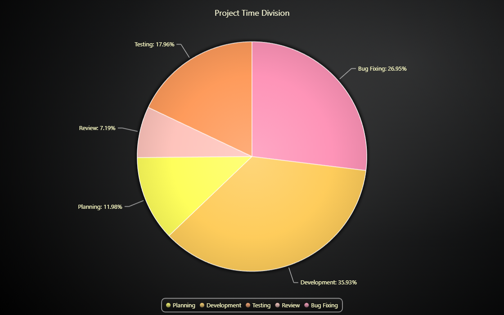

# JavaScript Pie Chart



This demo application belongs to the set of examples for LightningChart JS, data visualization library for JavaScript.

LightningChart JS is entirely GPU accelerated and performance optimized charting library for presenting massive amounts of data. It offers an easy way of creating sophisticated and interactive charts and adding them to your website or web application.

The demo can be used as an example or a seed project. Local execution requires the following steps:

-   Make sure that relevant version of [Node.js](https://nodejs.org/en/download/) is installed
-   Open the project folder in a terminal:

          npm install              # fetches dependencies
          npm start                # builds an application and starts the development server

-   The application is available at _http://localhost:8080_ in your browser, webpack-dev-server provides hot reload functionality.


## Description

Pie Chart (or a Circular Chart) is a chart used to show statistical graphic. The Pie Chart is divided into slices, with each slice illustrating a numerical portion of the whole Pie. Each slice's size (usually depicted in the central angle and area of the slice) is proportional to its quantity.

The chart can be created with a simple line of code.

```javascript
// Create a new Pie Chart.
const chart = lightningChart().Pie()
```

The Pie Chart has two types for displaying the labels for each slice; The slices can be placed either on top of each slice by using the LabelsInsideSlices type, or they can be placed on both sides of the Chart by using LabelsOnSides type. The type must be given to the Chart as a parameter when creating it.
By default, the LabelsOnSides type is used.

```javascript
// Create a new Pie Chart and pass the type to use when placing labels.
const chart = lightningChart().Pie({ type: PieChartTypes.LabelsOnSides })
```

After creating the Pie Chart, we can populate it by adding slices to it.
The slice should always get a name and value in a single object.

```javascript
// Add a slice to populate the Pie.
chart.addSlice({ name: 'Planning', value: 100 })
```

Each slice can be 'exploded' by clicking on them, and 'imploded' by clicking on a exploded slice.
Exploding slices can be set to only one at a time, or allowing all slices to be exploded at the same time.

```javascript
// Allow multiple slices to be in exploded state at the same time.
chart.setMultipleSliceExplosion(true)
```

The labels for all slices can be formatted in different ways.

```javascript
// Set the label formatting to show the slice's name and the relative value
// (size of the slice as percentage).
pie.setLabelFormatter(SliceLabelFormatters.NamePlusRelativeValue)
```

The lines connecting each slice to its label can be modified.


## API Links

* [Pie Chart]
* [Pie Chart Types]
* [Pie Slice label formatter]


## Support

If you notice an error in the example code, please open an issue on [GitHub][0] repository of the entire example.

Official [API documentation][1] can be found on [LightningChart][2] website.

If the docs and other materials do not solve your problem as well as implementation help is needed, ask on [StackOverflow][3] (tagged lightningchart).

If you think you found a bug in the LightningChart JavaScript library, please contact sales@lightningchart.com.

Direct developer email support can be purchased through a [Support Plan][4] or by contacting sales@lightningchart.com.

[0]: https://github.com/Arction/
[1]: https://lightningchart.com/lightningchart-js-api-documentation/
[2]: https://lightningchart.com
[3]: https://stackoverflow.com/questions/tagged/lightningchart
[4]: https://lightningchart.com/support-services/

© LightningChart Ltd 2009-2022. All rights reserved.


[Pie Chart]: https://lightningchart.com/js-charts/api-documentation/v7.0.1/classes/PieChart.html
[Pie Chart Types]: https://lightningchart.com/js-charts/api-documentation/v7.0.1/variables/PieChartTypes-1.html
[Pie Slice label formatter]: https://lightningchart.com/js-charts/api-documentation/v7.0.1/types/SliceLabelFormatter.html

